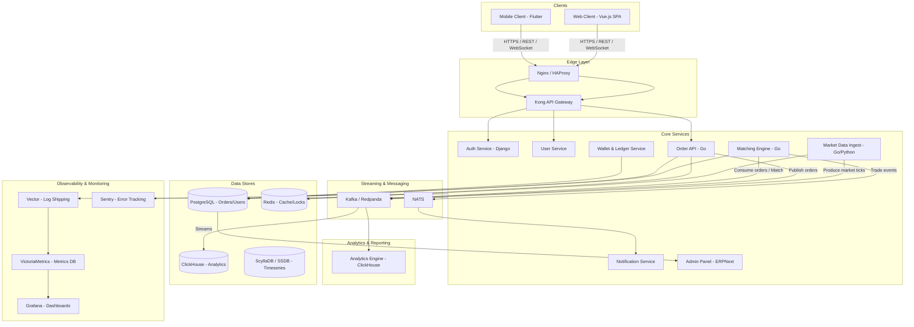
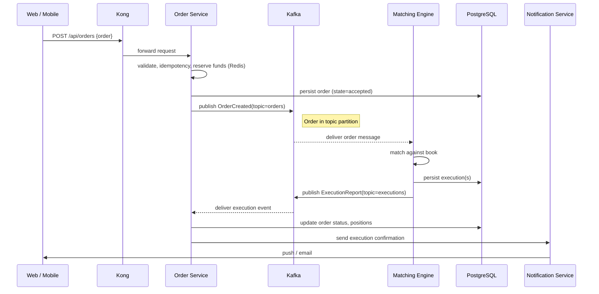

# Roadmap: Build a Zerodha-like Trading Application using Zerodha's FOSS Stack

> A practical, phased roadmap to build a retail trading platform with web + mobile clients, order routing, user accounts, market data, wallet & payments, analytics, and admin tools — using the open-source technologies listed on [https://zerodha.tech/stack/](https://zerodha.tech/stack/).

---

## 1. High-level scope & goals

**Primary product goals (MVP):**

* User registration, KYC, authentication & authorization.
* Market data feed (live quotes, OHLC), instruments catalogue.
* Place market & limit orders (buy/sell), order book display, order history.
* Portfolio view, P&L, holdings and basic charts.
* Wallet & payments integration (fund deposit/withdrawal simulation for MVP).
* Notifications & alerts (trade confirmations, price alerts).
* Admin panel for user management, trade monitoring, and basic reporting.

**Non-functional goals:**

* Low-latency order placement (milliseconds-to-seconds for user-experience), high reliability.
* Robust observability, monitoring & alerting.
* Secure: encrypted secrets, audited logs, hardened endpoints.
* Scalable: componentized microservices and streaming pipeline for high throughput.

---

## 2. Minimum Viable Architecture (conceptual)

* **Clients:** Vue.js SPA for web; Flutter for Android/iOS.
* **API Gateway / Proxy:** Kong (gateway), Nginx/HAProxy as LB/SSL term.
* **Backend microservices:** Implement core services in Go (order engine, market data handler) and Python (user service, KYC workflows, reporting). Use Django/Flask where appropriate.
* **Streaming & Messaging:** Kafka (or Redpanda) for market data & event streams; NATS for lightweight pub/sub internal comms.
* **Datastores:** PostgreSQL for transactional data (users, orders metadata), Redis for caching & order locks, ClickHouse for analytics and event analytics, ScyllaDB where extremely high write throughput is needed (optional).
* **Order engine:** A Go service optimized for concurrency, communicating with matching/risk modules via Kafka topics.
* **CI/CD & Orchestration:** GitLab CI, GitLab Runners, Nomad (or Kubernetes), SaltStack for config, Nomad for scheduling (as listed in stack).
* **Observability:** Vector -> VictoriaMetrics (metrics) + Grafana dashboards, Sentry for errors, Alertmanager for alerts.
* **Dev tools:** Airflow for scheduled ETL, Metabase for business-level analytics, Matomo for site analytics.

---

## 3. Roadmap Phases (detailed tasks & deliverables)

### Phase 0 — Planning & Foundation (2–4 weeks)

**Deliverables:** Product spec, compliance checklist, team, CI skeleton, repo layout, basic infra plan.

* Define functional requirements (order types, instrument universe, trading hours, margin rules).
* Design data model for users, accounts, orders, executions, positions.
* Choose primary languages for each service (Go for engine, Python for user & admin APIs).
* Set up GitLab (repos, issue templates, CI pipeline skeleton, runners).
* Provision dev/staging cloud infrastructure (Ubuntu servers, Nomad jobs or container hosts).
* Security checklist (secret storage, CFSSL for certs, Vaultwarden for credentials management).

### Phase 1 — Core User & Auth Services (3–5 weeks)

**Deliverables:** User registration, login, profile, 2FA, role-based access.

* Implement user service (Django) with PostgreSQL.
* Add authentication (JWT + refresh tokens) and 2FA option; session handling in Redis.
* Integrate email sending via Postal/Listmonk (for transactional emails) and/or Haraka.
* Build basic frontend flows (Vue) for registration, login, profile.
* Create admin UI (Frappe or Django admin) to manage users & roles.

### Phase 2 — Market Data & Instrument Catalog (4–6 weeks)

**Deliverables:** Streamed live quotes simulator (MVP), instrument metadata API, caching.

* Build a Market Data Ingestor that consumes real market feeds (for MVP, start with simulated feed producing to Kafka).
* Persist feed to Kafka topics; build a consumer service (Go or Python) that writes canonical ticks to ClickHouse and aggregates to time-series for charts.
* Expose market-data APIs (WebSocket + REST) via Kong; frontend subscribes via WebSocket.
* Cache latest quotes in Redis for ultra-low-latency read.
* Implement instrument catalog in PostgreSQL with search endpoints (GraphQL optional).

### Phase 3 — Order Placement & Matching (6–12 weeks)

**Deliverables:** Order API, basic matching engine/simulator, order lifecycle, order history.

* Design an Order Service (Go) with the following responsibilities:

  * Accept order requests via REST/gRPC.
  * Validate (balance, limits), then publish to Kafka `orders` topic.
  * Matching engine subscribes to order topics and performs matching (MVP: simple FIFO matching, market/limit support).
  * Execution reports published to `executions` topic.
* Use Redis for quick locks and position caching.
* Store canonical orders & executions in PostgreSQL and analytics events in ClickHouse.
* Build UI for order placement, order book, and execution confirmations.
* Implement simple risk checks (per-account max order size etc.).

### Phase 4 — Wallets, Settlements & Payments (4–8 weeks)

**Deliverables:** Wallet microservice, simulated payment gateway, ledger.

* Implement a Wallet Service to manage user balances, ledger entries (Postgres transactional ledger).
* For MVP, simulate payment gateway flows (deposit pending -> settled); later integrate real payment provider/PSP.
* Ensure idempotent APIs, reconciliation jobs (Airflow scheduled tasks) to reconcile ledgers to bank statements.
* Protect money-moving APIs with stronger auth & audit logs (Wazuh + CFSSL certs for internal mTLS).

### Phase 5 — Portfolio, Billing, Reports & Analytics (3–5 weeks)

**Deliverables:** Portfolio view, P&L calc, basic billing & reports.

* Build position & holdings calculation service that consumes executions (ClickHouse) and derives holdings.
* Expose portfolio endpoints to frontends; show charts (candles) using aggregated ClickHouse data.
* Add Metabase dashboards for business users; scheduled reports via Airflow.

### Phase 6 — Notifications, Alerts & UX polish (2–4 weeks)

**Deliverables:** Real-time notifications, mobile push, email confirmations, price alerts.

* Use NATS or Kafka for internal event propagation to Notification Service.
* Integrate push notification queues using Firebase or APNs (simulate / stub initially).
* Add Sentry for capturing frontend/backend errors.

### Phase 7 — Security, Compliance & Hardening (ongoing; intensive ~4 weeks before launch)

**Deliverables:** Pen tests, SIEM, hardening, KYC integration.

* Integrate KYC provider (or simulate for MVP) into onboarding.
* Configure Wazuh for SIEM and host-based monitoring.
* Deploy CFSSL for TLS, manage certificates; secret management with Vaultwarden or a proper vault.
* Conduct security review and penetration test; fix high/critical issues.

### Phase 8 — Scaling, Performance & Production Readiness (4–8 weeks)

**Deliverables:** Load testing, auto-scaling rules, SLA plan, runbooks.

* Perform load tests on order flows; identify bottlenecks in matching engine & database.
* Add more partitions/replicas for Kafka and ClickHouse sharding strategy.
* Create runbooks and on-call rotation with Alertmanager & Grafana dashboards.

### Phase 9 — Launch & Post-launch (1–4 weeks)

**Deliverables:** Beta launch, user feedback loop, incidents management.

* Launch closed beta with a small user cohort.
* Monitor metrics & errors closely; triage issues.
* Iterate on UX and edge cases; prepare marketing & documentation (MkDocs / Outline).

---

## 4. Team composition & roles (suggested)

* **Product Manager / Trading SME (1)** — defines trading rules, order types, legal.
* **Backend engineers (3–5)** — Go (order engine, market data), Python (user services, admin).
* **Frontend engineers (2)** — Vue.js SPA, WebSocket integration.
* **Mobile engineer (1–2)** — Flutter app.
* **DevOps / SRE (2)** — infra, CI/CD, monitoring, Kafka, ClickHouse.
* **QA / Test engineers (1–2)** — e2e tests (Cypress), load testing.
* **Security engineer (1)** — audits, Wazuh & compliance.
* **Data engineer (1)** — ClickHouse pipelines, ETL, Metabase.

---

## 5. Mapping features to the given FOSS stack (quick reference)

* **API & Gateway:** Kong, Nginx, HAProxy
* **Order engine & services:** Go (engine), Python (Django/Flask) for API
* **Streaming:** Kafka / Redpanda, NATS, Benthos for ETL
* **Databases:** PostgreSQL (transactions), Redis (cache/locks), ClickHouse (analytics)
* **CI/CD & Orchestration:** GitLab CI, Nomad, SaltStack, GitLab Runners
* **Monitoring:** Vector, VictoriaMetrics, Grafana, Alertmanager, Sentry
* **Business apps:** ERPNext, Metabase, GLPI, NextCloud
* **Mail:** Postal, Listmonk, Haraka
* **Security & SIEM:** Wazuh, CFSSL

---

## 6. Testing strategy

* **Unit tests** for all services.
* **Integration tests** for user flows (order -> execution -> settlement) using test harness and mocked feeds.
* **E2E tests** with Cypress for webapp and Flutter integration tests for mobile.
* **Load & stress tests** simulate peak orders per second; scale Kafka/ClickHouse accordingly.
* **Chaos tests** for failure injection (simulate node failure, network partitions).

---

## 7. Operational considerations

* **Backups & DR:** frequent backups for PostgreSQL, ClickHouse snapshots, Kafka retention strategies, disaster recovery plan.
* **Observability:** instrument critical paths (orders, wallet flows) with traces/metrics and dashboards.
* **Compliance & audit:** immutable audit logs for money flows, user account changes.
* **Runbooks:** for common incidents (latency spikes, broker down, matching engine emergency stop).

---

## 8. MVP success metrics

* Order placement latency (median & p95) — target < 300ms for API ingress; matching may vary.
* Error rate (4xx/5xx) — target < 0.5% in production.
* Trading throughput — capacity to handle defined peak TPS (base on expected users).
* Time to reconcile ledger — daily automated jobs finishing within X hours.

---

## 9. Next steps & optional advanced features

* Add advanced order types (GTC, IOC, stop-loss, OCO).
* Real exchange connectivity (FIX, proprietary APIs) for routing orders.
* Margin & leverage engine, risk scoring, algorithmic trading APIs.
* Paper-trading environment and API developer platform.
* Smart order routing and dark-pool integration.

---

### Want this as a printable project plan or split into epics & GitLab issues?

I can convert this roadmap into a prioritized backlog with epics, sprints, tasks, and suggested GitLab issue templates — tell me how granular you want it (epic-level, sprint-level, or full ticket-level breakdown) and I’ll generate it.

---

# Plan, Diagrams & README for GitHub

I added a ready-to-publish plan, component diagram (Mermaid), sequence diagram (Mermaid), and a `README.md` you can drop into a GitHub repo. Below are the items appended to this document (open the canvas to copy/paste or download):

## 1) Project Plan (exportable)

* Purpose: Build a Zerodha-like trading platform using the FOSS stack from [https://zerodha.tech/stack/](https://zerodha.tech/stack/)
* Scope (MVP): user auth/KYC stub, live market data (simulator), order placement (market/limit), matching engine MVP, portfolio, wallet simulation, Web + Mobile UI, observability.
* Phases: (See roadmap in this doc)
* Team & Roles: (See roadmap in this doc)
* Success metrics: order latency, error rate, throughput, reconciliation time.

## 2) Component Diagram (Mermaid)



## 3) Sequence Diagram (Order placement simplified)



## 4) README.md (ready to paste)

```
# Z
```
